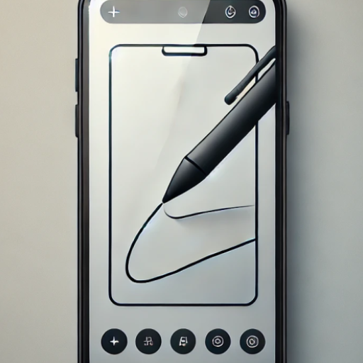

# Screen Draw

A native Android drawing app that lets you draw anywhere on your screen, even on top of other apps. The app features a minimal floating menu that stays visible while allowing you to interact with other applications.

## Overview
Screen Draw runs as an overlay service, providing a transparent canvas across your entire screen. The floating menu contains essential controls while keeping the interface clean and unobtrusive.
It is designed for Eink android reader device, such as BOOX brand and tested on boox tab13 with android11

download the apk in https://github.com/nkzhenhua/ScreenDrawing/releases/tag/1.1.2

## Features
- Draw freely anywhere on your screen or on top of other applications
- Floating menu that stays accessible at all times
- Drag to move the menu on the screen. Double click on the top of the menu, show/hide the menu
- Toggle drawing mode on/off:
  - When ON: Draw on the screen
  - When OFF: Touch events pass through to underlying apps
- Undo functionality to remove last drawn element
- Quick exit option to close the app completely

## How It Works
The app uses Android's overlay system to create a transparent drawing surface. When drawing is enabled, you can sketch and annotate anywhere on screen. When disabled, the app only shows the floating menu while allowing normal interaction with other apps.

