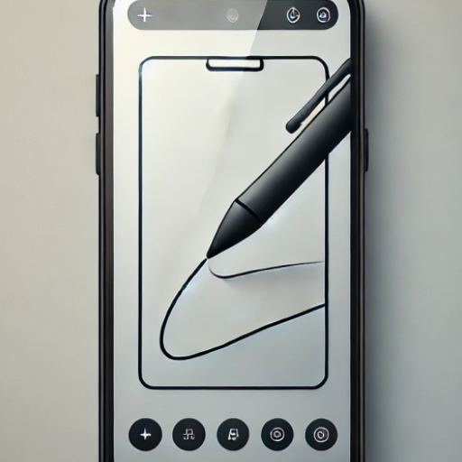

# Screen Draw

A native Android drawing app that lets you draw anywhere on your screen, even on top of other apps. The app features a modern capsule-style floating menu that stays visible while allowing you to interact with other applications.

## Overview
Screen Draw runs as an overlay service, providing a transparent canvas across your entire screen. The floating menu contains essential controls while keeping the interface clean and unobtrusive.
It is designed for Eink android reader device, such as BOOX brand and tested on boox tab13 with android11.

## Download
### GitHub:
https://github.com/nkzhenhua/ScreenDrawing/releases/tag/1.1.9

### Google Play:
https://play.google.com/store/apps/details?id=com.eink.screendrawing

## Features
- **Draw freely** anywhere on your screen or on top of other applications
- **Modern floating menu** with sleek capsule design and icon buttons:
  - ✏️ Toggle drawing mode (blue highlight when active)
  - ↩️ Undo last stroke
  - 🗑️ Clear all drawings
  - ⏻ Exit app
- **Drag to move** the menu anywhere on the screen
- **Double-tap** the drag handle to show/hide the menu buttons
- **Toggle drawing mode**:
  - When ON: Draw on the screen (blue indicator)
  - When OFF: Touch events pass through to underlying apps

## How It Works
The app uses Android's overlay system to create a transparent drawing surface. When drawing is enabled, you can sketch and annotate anywhere on screen. When disabled, the app only shows the floating menu while allowing normal interaction with other apps.

## Screenshots
<!-- Add screenshots of the new menu design here -->

## Requirements
- Android 8.0 (API 26) or higher
- Overlay permission
